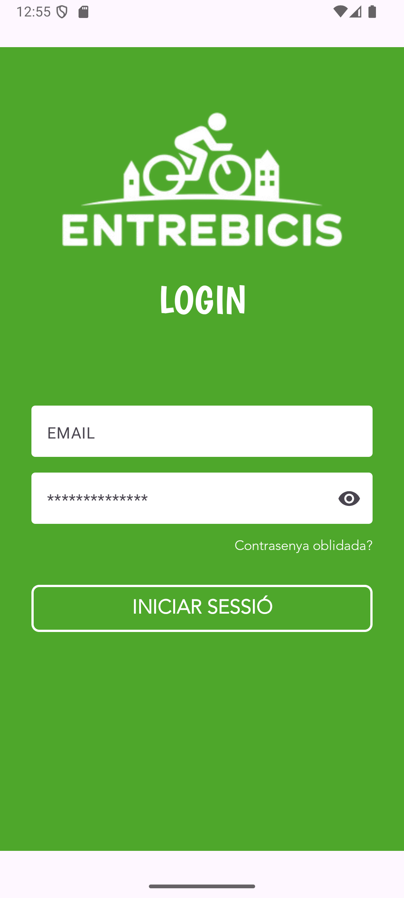
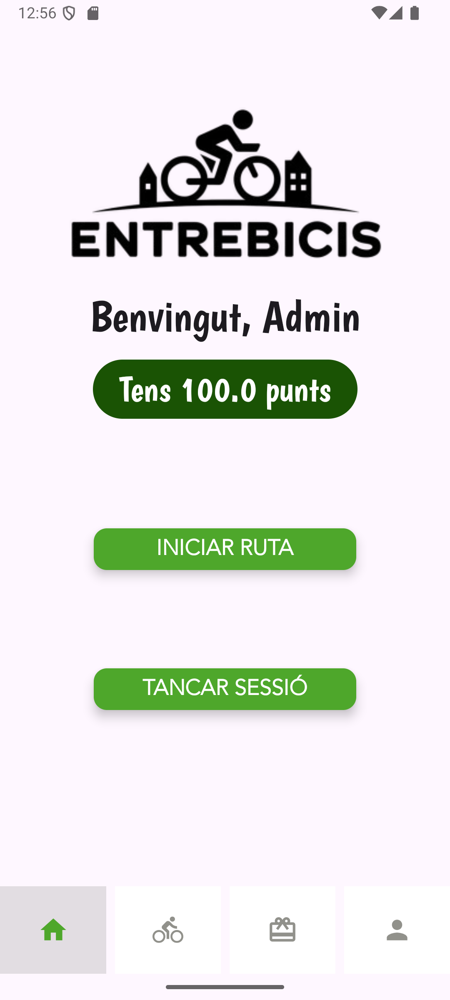
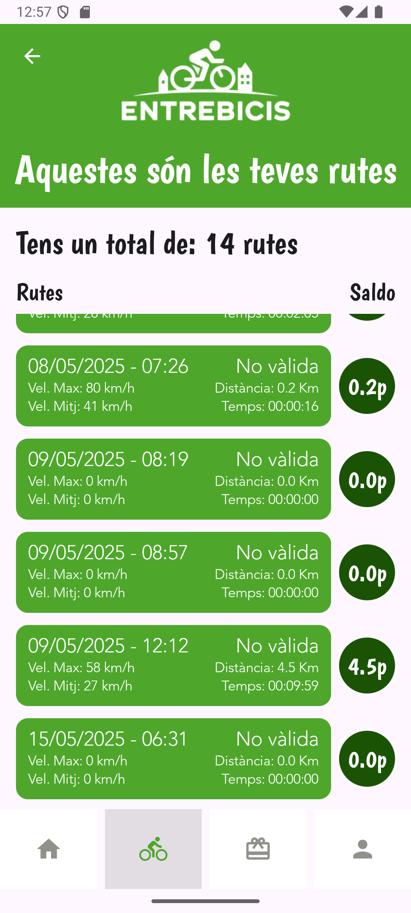
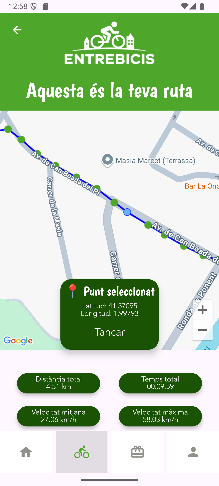
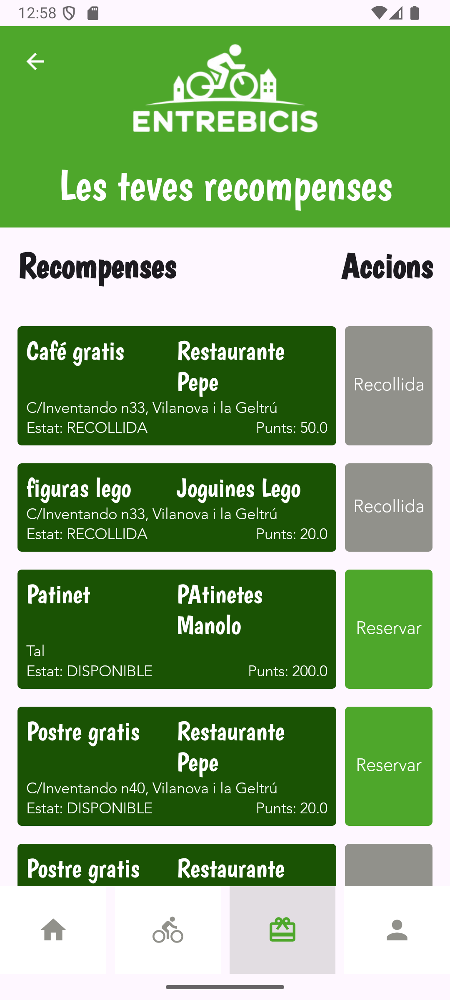
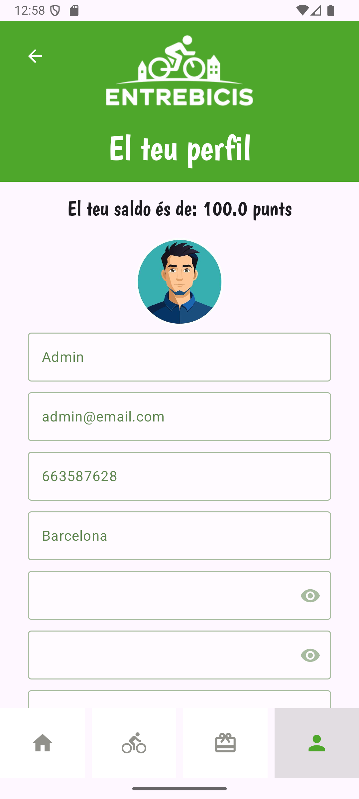
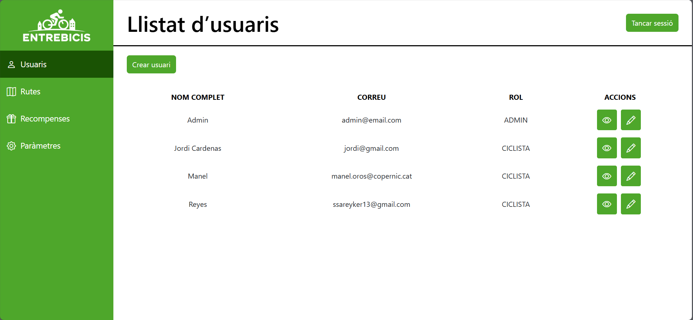
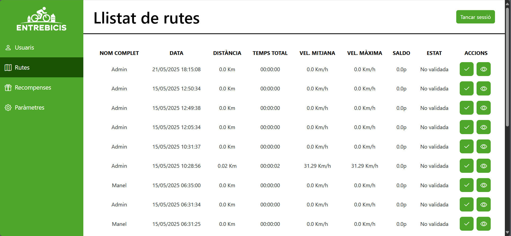
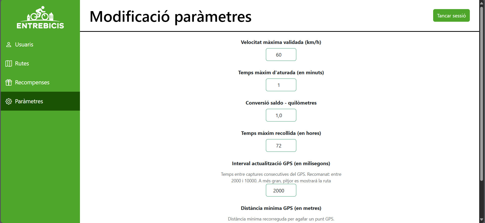

# 🚲 EntreBicis

  

Una solució digital per fomentar l’ús de la bicicleta com a mitjà de transport sostenible a Vilanova i la Geltrú. **Entrebicis** permet als usuaris registrar les seves rutes en bicicleta, guanyar punts per cada quilòmetre recorregut i bescanviar-los per recompenses en comerços locals.

Aquest repositori conté tot el desenvolupament de la solució:

- 📱 Aplicació mòbil per a usuaris (Android)
- 🖥️ Panell web d'administració (Spring Boot + Thymeleaf)
- 📄 Documentació tècnica i funcional

---

## 🎯 Objectiu del projecte

Promoure la mobilitat sostenible i el comerç local mitjançant un sistema de recompenses per l’ús de la bicicleta.

---

## 🎥 Vídeo de presentació

  

---

## 📱 Aplicació mòbil (Android)

- Registre i inici de sessió mitjançant autenticació JWT
- Inici i finalització de rutes amb GPS, guardant localitzacions
- Acumulació de punts segons la distància recorreguda
- Bescanvi de recompenses des de l’app
- Recuperació de contrasenya
- Disseny modern amb Jetpack Compose

<table>
  <tr>
    <td></td>
    <td></td>
    <td></td>
  </tr>
  <tr>
    <td></td>
    <td></td>
    <td></td>
  </tr>
</table>

---

## 🖥️ Aplicació web (admin)

- Gestió d’usuaris, rutes i recompenses
- Visualització de rutes amb mapa
- Estadístiques d’ús i saldo de punts
- Canviar els parámetres del sistema
- Formularis amb validacions i càrrega d’imatge per perfils

|  |  |  |
|:---:|:---:|:---:|
|  |  |  |

---

## 🛠️ Tecnologies utilitzades

- 🔙 **Backend**: Java 21 + Spring Boot + Spring Security + JWT + MySQL
- 🖥️ **Frontend Web**: Thymeleaf + Bootstrap 5
- 📱 **Frontend Android**: Kotlin + Jetpack Compose + Clean Architecture
- 🛰️ **Comunicació**: API REST
- ☁️ **Desplegament**: Docker Compose + MySQL + servidor EC2 (AWS)

---

## 📂 Estructura del repositori

- `Documentació/`: documentació tècnica (`index.adoc`, diagrames, etc.)
- `Backend/`: projecte Spring Boot (controladors, seguretat, entitats, serveis, etc.)
- `Frontend/`: aplicació Android (Jetpack Compose, repositoris, viewmodels, etc.)
- `index.adoc`: aquest arxiu de presentació general del projecte

---

## 🤝 Crèdits

- **Desenvolupat per**: Reyes Amador  
- **Centre**: Institut Nicolau Copèrnic  
- **Any**: 2025
